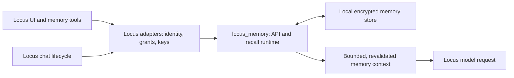

# Locus Memory

A local-first memory engine for Locus and other Python hosts. It stores durable
memories, enforces access scopes, retrieves relevant context, and manages review,
correction and forgetting.

`locus-memory` is the distribution name; `locus_memory` is the Python import. It
runs inside the host process, needs no daemon or cloud account, and has one runtime
dependency: `cryptography`. Python 3.10 or later is required. Licensed under
[Apache-2.0](LICENSE).

## How Locus uses it

The reusable memory implementation lives in this repository. Locus still owns its
UI, HTTP and tool endpoints, application paths, key custody, trusted user/workspace/
agent identity, session files, and model calls. Small Python adapters connect those
host capabilities to this package.

Locus builds and vendors a `locus-memory==0.2.0` wheel, pins its SHA-256 in its
runtime dependency lock, and bundles it inside the app. At runtime it imports
`locus_memory` directly. The installed app needs neither a checkout of this
repository nor a connection to GitHub.



1. **Open the correct store.** Locus supplies the profile path, edition/partition,
   and a key provider. Persisted ownership selects the package-backed vault after
   cutover; changing a recall flag does not change the owner of the data.
2. **Read and write through the package.** Locus's UI and routes call its thin
   `MemoryVault` facade, which delegates to
   [`CanonicalMemoryVault`](src/locus_memory/compat/canonical_vault.py) and
   [`MemoryEngine`](src/locus_memory/engine.py). The package owns authorization,
   validation, encryption and lifecycle transitions.
3. **Recall before a model call.** Locus's `MemoryAdapter` binds its chat state to
   [`RecallRuntime`](src/locus_memory/runtime.py). The package retrieves approved
   memories within trusted scopes and builds a token-bounded context packet. Locus
   revalidates that packet before use and adds its text to the model request.
4. **Review new memories.** Agent tools have read/propose permissions. Proposals
   remain candidates until user approval; candidates are excluded from automatic
   recall. Corrections and deletion invalidate affected context. Session and
   workspace changes clear previously injected memory and continuity text.

Locus also delegates memory settings, selected-chat candidate review, continuity
snapshot composition, saved-chat indexing, ownership fencing and offline migration
to this package. It supplies the host scheduling and session callbacks. Encrypted
transcript archival is separately opt-in with `LOCUS_MEMORY_ARCHIVE=1`.

### Code ownership and data location

| Concern | Owner |
|---|---|
| Record semantics, encryption, scope enforcement, retrieval, context packets, lifecycle, forgetting | `locus-memory` |
| Recall/archive coordination, memory policy, candidate review, continuity composition, transcript indexing, migration mechanics | `locus-memory` |
| UI, HTTP/tool transport, consent, trusted identity/grants, key custody, app paths, model calls and session persistence | Locus |
| Packaging and selection of the bundled package version | Locus runtime build |

Memory-related adapter files intentionally remain in Locus. The extraction moves
the reusable implementation; it does not remove the application's integration or
copy a user's memories into either source repository.

For the standard Locus profile:

| Local path | Purpose |
|---|---|
| `~/.ollama-code/memory-engine/` | Package-native encrypted memory, deletion ledger and ownership control |
| `~/.ollama-code/memory/master.key` | Existing host-managed key; Locus derives the engine key through its key provider |
| `~/.ollama-code/memory/memory.sqlite3` | Legacy encrypted continuity/observation families and memory rollback compatibility |
| `~/.ollama-code/transcript-index.sqlite3` | Existing derived plaintext saved-chat search index |

Other editions/profiles supply different roots and partitions. Continuity snapshots
and skill observations retain their legacy encrypted formats and family ownership,
although their implementation is in this package. They have not been converted to
verified episodes or governed procedures. Saved-chat FTS is also a compatibility
component, separate from the encrypted engine history archive.

The exact module boundary is documented in [Host extraction](docs/host-extraction.md).

## Package modules

| Module | Responsibility |
|---|---|
| [`engine.py`](src/locus_memory/engine.py) | Typed public memory API |
| [`compat/`](src/locus_memory/compat/) | Legacy-shaped canonical API and existing encrypted vault/continuity formats |
| [`runtime.py`](src/locus_memory/runtime.py) | Recall, shadow comparison, context revalidation, archival and maintenance |
| [`policies.py`](src/locus_memory/policies.py) | Shared memory defaults, scopes and budgets |
| [`retrieval/`](src/locus_memory/retrieval/), [`context/`](src/locus_memory/context/) | Ranking, context compilation, receipts and continuity payloads |
| [`learning/`](src/locus_memory/learning/) | Candidate review, episodes, procedures and consolidation |
| [`history/`](src/locus_memory/history/) | Encrypted history archive and separate compatibility transcript search |
| [`migrations/`](src/locus_memory/migrations/) | Inventory, snapshot, validation, cutover, rollback, ownership and leases |
| [`storage/`](src/locus_memory/storage/), [`crypto.py`](src/locus_memory/crypto.py) | Encrypted persistence, partitions, key wrapping and deletion ledger |
| [`repository/`](src/locus_memory/repository/), [`providers/`](src/locus_memory/providers/) | Repository observations and host-supplied provider contracts |

## Install from source

Version **0.2.0** is available as source in this repository. It has not been
published to PyPI; Locus currently consumes a locally built, hash-pinned wheel.

```bash
git clone https://github.com/nahid-sparktales/locus-memory.git
cd locus-memory
python3 -m venv .venv
.venv/bin/python -m pip install .
```

To build an installable wheel:

```bash
.venv/bin/python -m pip wheel --no-deps --wheel-dir dist .
.venv/bin/python -m pip install dist/locus_memory-0.2.0-py3-none-any.whl
```

The build backend requires `setuptools>=77`. Pip's default build isolation
installs it; with `--no-build-isolation`, provide a compatible setuptools first.
For offline installation, prepare a wheelhouse containing this wheel,
`cryptography` and its platform dependencies.

## Try it

The quickstart exercises persist, restart, retrieve, correct, context compilation
and forgetting, then checks for plaintext canaries in the native encrypted store:

```bash
.venv/bin/python examples/quickstart.py /tmp/locus-memory-demo
```

A minimal in-process example with a temporary store:

```python
import secrets
from pathlib import Path
from tempfile import TemporaryDirectory

from locus_memory import MemoryEngine, StaticKeyProvider
from locus_memory.models import (
    AccessContext, Actor, ContextRequest, Operation, PartitionRef, RememberRequest,
)

with TemporaryDirectory() as directory:
    keys = StaticKeyProvider({"demo": secrets.token_bytes(32)})
    access = AccessContext(
        principal="demo-user",
        partition=PartitionRef("standalone", "demo"),
        actor=Actor.USER,
        operations=frozenset({Operation.READ, Operation.WRITE}),
    )
    with MemoryEngine(Path(directory) / "memory", keys) as engine:
        engine.remember(access, RememberRequest(
            content="Prefer concise answers", kind="preference",
        ))
        packet = engine.build_context(access, ContextRequest(
            token_allowance=200, query="answer style",
        ))
        print(packet.text)
```

A persistent host supplies a stable `KeyProvider` and builds `AccessContext` from
its authenticated state. Stored content and model arguments must never establish
authority. Scoped records require matching `ScopeGrants` on the access context.

### Command line

The standalone CLI uses its own root and file-key provider:

```bash
.venv/bin/locus-memory --root ./demo-store init
.venv/bin/locus-memory --root ./demo-store remember "Prefer concise answers"
.venv/bin/locus-memory --root ./demo-store search "answer style"
.venv/bin/locus-memory --help
```

It also supports candidate review, history, context inspection, repository memory,
key rotation and migration. Destructive forget, export and migration commands
preview by default and require `--yes` to execute. Exit code 2 means preview-only.

For an existing Locus profile, use **Locus's** `ollama_code.memory_migration`
entry point, which supplies the correct host key, partition, lease and process
checks. The standalone CLI's defaults target a separate store. See
[migration and rollback](docs/migrations-and-rollback.md) and
[host extraction](docs/host-extraction.md).

## Validation and current limits

The 0.2.0 extraction passed **1,545 package tests** (one optional host-parity test
skipped) and **215 Locus host/backend tests** on CPython 3.14.6. The installed wheel
passed standalone CLI/quickstart checks and isolated imports of all 71 modules.
A clean rebuild was byte-identical. Locus's signed local Release build and
installed runtime were verified after cutover, including a safe rollback preview.

The earlier engine baseline was also tested on CPython 3.10.22. The latest 0.2.0
extraction was verified on 3.14.6; 3.11, 3.12 and 3.13 have not been verified here.
These are recorded local checks, not claims of a published app or PyPI release.

```bash
.venv/bin/python -m pip install -e '.[dev]'
.venv/bin/python -m pytest -o addopts="" -q
.venv/bin/ruff check src tests
```

The optional parity test needs `LOCUS_SOURCE_DIR` pointing at an unmodified Locus
`b332e455` source export. Repository tests need Git. See
[verification history](docs/PROGRESS.md) for earlier runs and
[`scripts/verify_wheel.sh`](scripts/verify_wheel.sh) for isolated wheel checks.

Important boundaries:

- Native records, history and vectors are encrypted with AES-256-GCM. Native
  search projections are in memory. The compatibility saved-chat index described
  above is plaintext on disk; encryption claims do not cover that cache or the
  host's raw session files. Some native metadata remains visible.
- Candidates do not enter recall, and scope filtering precedes content decryption.
  The host controls consent, grants and any model/provider egress. Forgetting
  cannot recall text already sent to a model.
- Deletion receipts and the ledger support crash recovery. Full protection when
  both the database and ledger are restored requires a host ledger mirror;
  Locus currently supplies none. Receipt limitations identify remaining copies.
- Verified episodes, governed procedures, repository memory and provider
  contracts exist, but not every package capability has a Locus UI or automatic
  integration. Creating governed procedures through the ordinary memory form,
  and changing an existing memory's kind or scope, remain explicit errors.
- Retrieval evaluation is synthetic. The recorded benchmark met 11 of 13
  criteria; strict correction propagation through raw history and abstention
  accuracy remain unmet. Only deterministic fake providers ship. See
  [evaluation results](docs/evaluation.md).

## Documentation

- [Host extraction and ownership](docs/host-extraction.md)
- [Architecture](docs/architecture.md)
- [Storage and encryption](docs/storage-and-encryption.md)
- [Security and privacy](docs/security-and-privacy.md)
- [Migration and rollback](docs/migrations-and-rollback.md)
- [Feature matrix](docs/feature-matrix.md)
- [Repository interchange](docs/repository-interchange.md)
- [Workflow integration contracts](docs/integration-workflows.md)
- [Development and verification history](docs/PROGRESS.md)
- [Historical Locus compatibility audit](docs/locus-compatibility.md)
- [Historical extraction plan](docs/ownership-and-extraction.md) and [handoff patches](handoff/locus/README.md)

## License

Apache-2.0. See [LICENSE](LICENSE) and [NOTICE](NOTICE).
